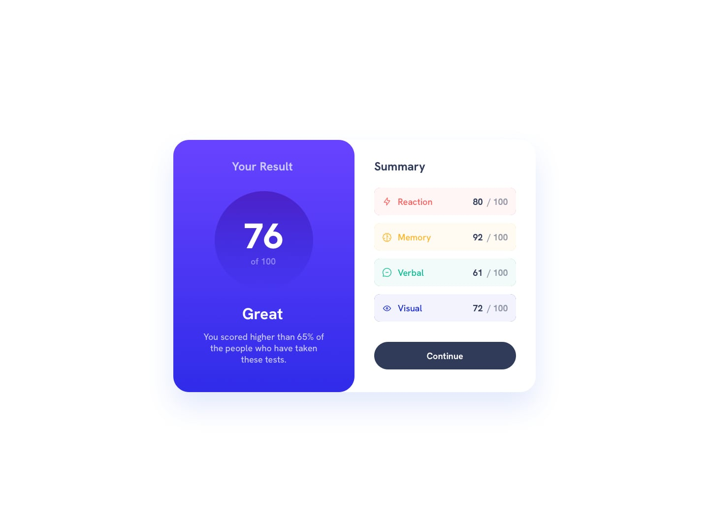

# Results summary component



## Table of contents

- [Overview](#overview)
  - [The job](#the-job)
  - [Links](#links)
- [My process](#my-process)
  - [Built with](#built-with)
  - [Useful resources](#useful-resources)
- [Author](#author)

## Overview

### The job

Users should be able to:

- View the optimal layout for the interface depending on their device's screen size
- See hover and focus states for all interactive elements on the page
- **Bonus**: Use the local JSON data to dynamically populate the content

### Links

- Repo URL: [https://github.com/ferfalcon/results-summary-component](https://github.com/ferfalcon/results-summary-component)
- Live URL: [TBD](TBD)

## My process

### Built with

- Semantic HTML5 markup
- CSS custom properties
- Flexbox
- CSS Grid
- Mobile-first workflow
- [Vite](https://vite.dev/) - Frontend build tool
- [Figma](https://www.figma.com/) - Edit design files

### Useful resources

- [Google | Build with Modern Web Guidance](https://developer.chrome.com/docs/modern-web-guidance) - Modern Web Guidance is a set of skills that embed web platform expertise, best practices, and browser compatibility data directly into your coding agents.
```bash
pnpm dlx skills add GoogleChrome/modern-web-guidance
```

## Author

* Website - [ferfalcon.com](http://ferfalcon.com/)
* LinkedIn - [Fernando Falcon](https://www.linkedin.com/in/fernandofalcon/)
